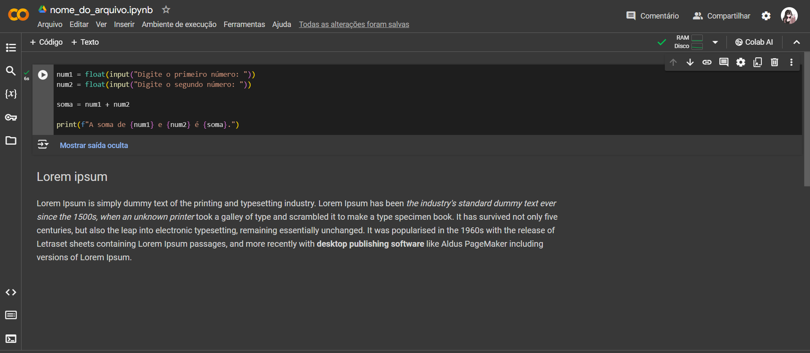
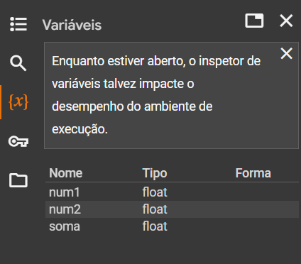
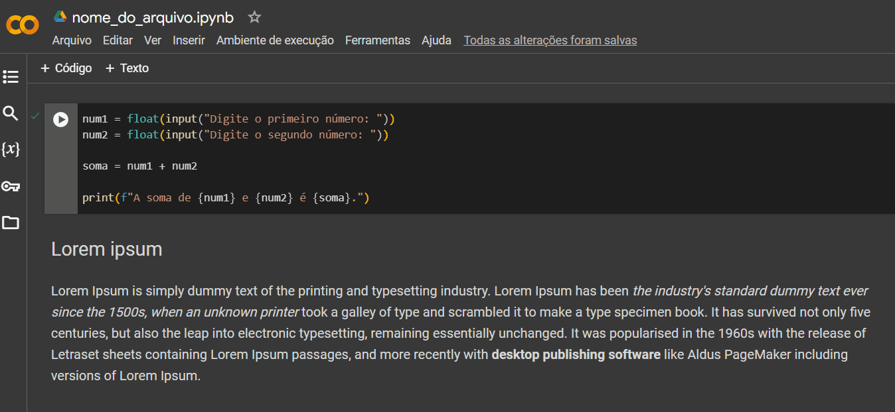

# Google Colab

## 1. O que é?

Desenvolvido pela Google Research, o Google Colaboratory (ou Google Colab), é uma IDE (_Integrated Development Environment_ ou em português Ambiente de Desenvolvimento Integrado) gratuita em nuvem que executa códigos interativos chamados de _notebooks_ no computador, sem a necessidade de instalar algum software. Foi criado para incentivar o estudo de Inteligência Artificial (IA) e Aprendizado de Máquina. Nele, o usuário pode facilmente compartilhar e modificar o código.

## 2. O que são notebooks?

Um _notebook_ é uma espécie de caderno, onde são documentadas histórias por partes que seguem um fluxo lógico, desde introdução até conclusão. Podem ser compostos por blocos de texto, blocos de código e também imagens, gráficos e equações matemáticas. Neles, o usuário pode executar determinadas partes (células) do código observando sua saída e, também, fazer as alterações necessárias. Geralmente são utilizados em estudos de Ciência de Dados (como Aprendizado de Máquina) e podem ser compartilhados entre usuários e modificado pelos mesmos.

## 3. O que são células?

As células são os blocos onde código e texto serão escritos e executados. Em um _notebook_, existem dois tipos principais de células:

- **Células de texto/Markdown:** utilizam a sintaxe markdown para marcação e são utilizadas para adicionar texto formatado, listas, cabeçalhos, links, imagens, entre outros;

- **Células de código:** são utilizadas para escrever e executar códigos, possibilitando a execução por partes.

## 4. O que é o Jupyter?

Fundado em 2015 e originado do IPython (2014), o Jupyter é um software gratuito e de código aberto criado para que os usuários possam desenvolver em diversas linguagens de programação. O nome do projeto faz alusão às três linguagens de programação principais suportadas pelo Jupyter: Julia, Python e R. Além disso, presta homenagem aos cadernos de anotações de Galileu, onde ele documentou a descoberta das luas de Júpiter.

## 5. Principais operações da ferramenta

Abaixo estão descritos os principais componentes da interface do Google Colaboratory:

**1. Barra de ferramentas**

- **Arquivo:** criar um novo arquivo, abrir um arquivo já existente, enviar um arquivo do computador, renomear, mover, deletar, salvar, fazer download, imprimir, entre outras;

- **Editar:** desfazer e refazer ações, selecionar todas as células, recortar célular, copiar células, colar células, localizá-las, excluí-las, entre outras;

- **Ver:** índice, informações e opções de visualização do documento;

- **Inserir:** inserir células de código ou texto, entre outras;

- **Ambiente de execução:** opções de execução, interromper, reiniciar, desconectar, alterar tipo de ambiente e opções de gerenciamento;

- **Ferramentas:** paleta de ferramentas, configurações e atalhos;

- **Ajuda:** ferramentas de ajuda, como: perguntas frequentes, enviar feedback, informar bugs, termos de serviço, entre outras.

**2. Barra lateral superior**

- **Índice**;
- **Localizar e substituir**;
- **Variáveis:** mostra todas as variáveis utilizadas no código;
- **Secrets:** mantém e gerencia informações sensíveis, como senhas e outros dados sensíveis que não se deseja exibir no código do _notebook_;
- **Arquivos:** árvore de arquivos contidos no ambiente;

**3. Barra lateral inferior**

- **Snippets de códigos:** pequenos trechos de código pronto que podem ser fácil e rapidamente adicionados ao seu _notebook_;
- **Paleta de comandos**;
- **Terminal (ferramenta premium):** terminal do ambiente de execução, porém, só é possível o acesso após inscrever-se no Colab Pro (serviço pago).

**4. Adicionar células de código ou texto**

**5. Células de código/texto**

