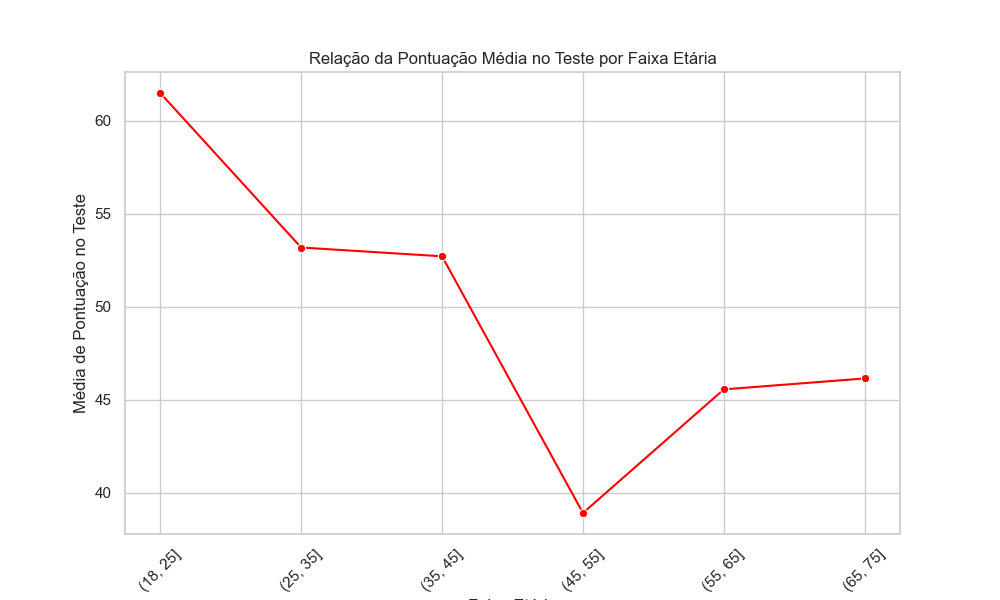
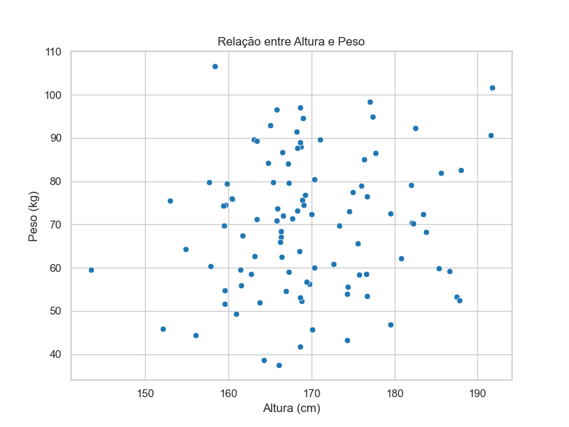
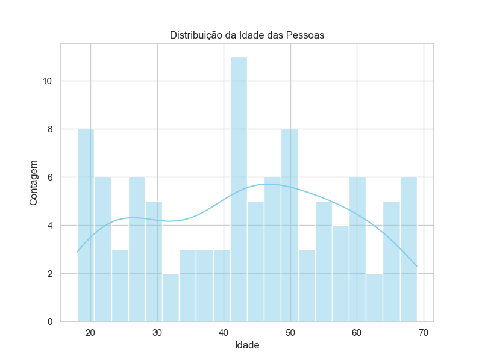
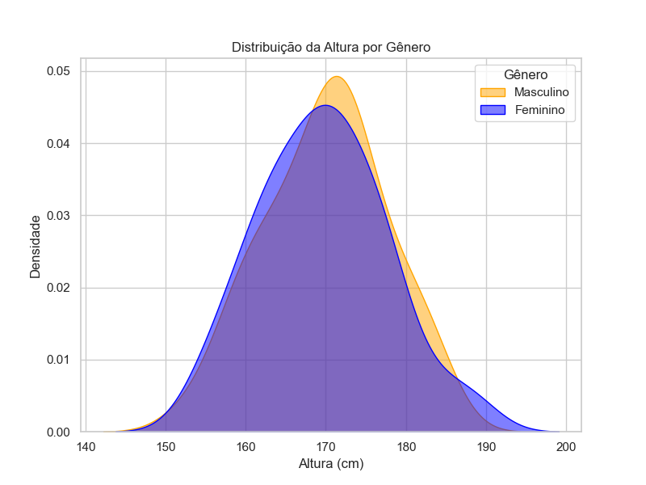
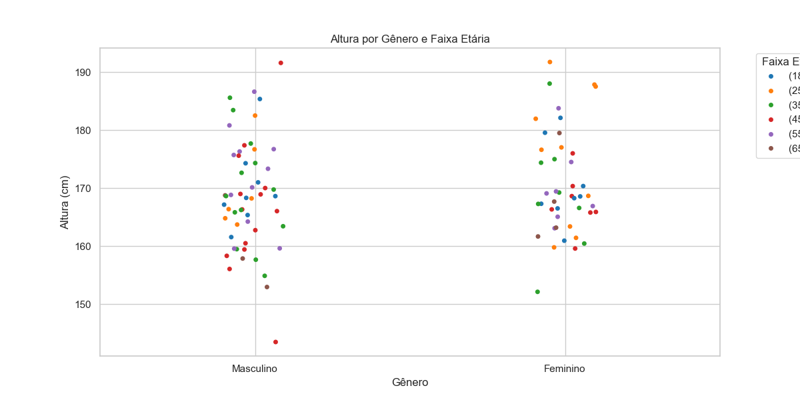
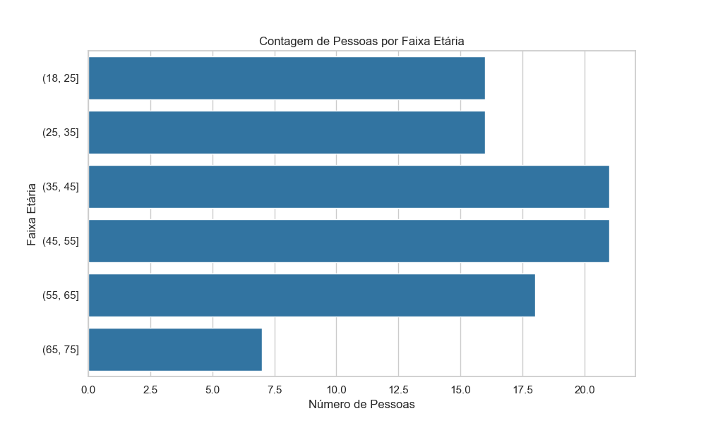
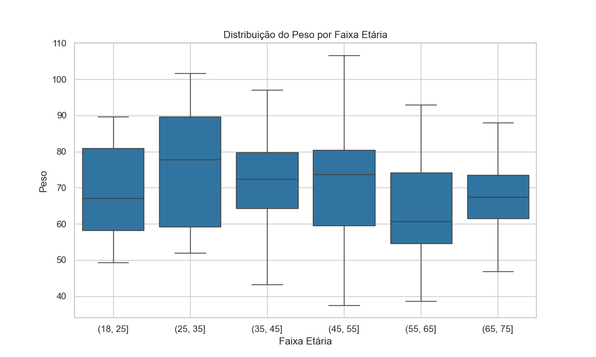
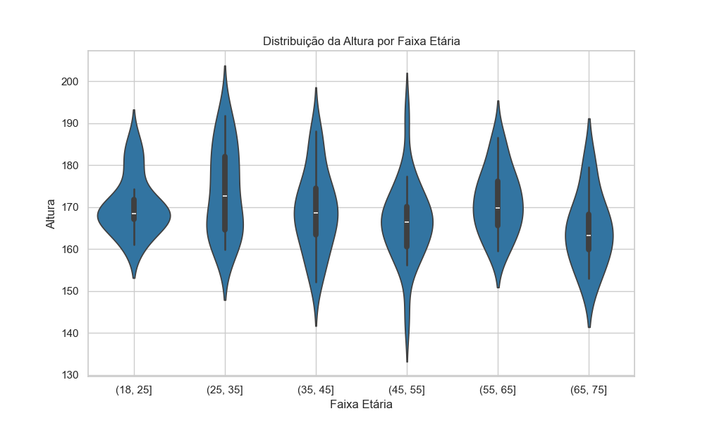

# Seaborn

Seaborn é uma biblioteca de visualização de dados, construída sobre o matplotlib, que simplifica a criação de gráficos estatísticos complexos. Muito utilizada para análise exploratória de dados e comunicação de resultados.

```sh
import seaborn as sb
# Para os próximos tópicos teremos que usar essas outras bibliotecas também: 
import matplotlib.pyplot as plt
import pandas as pd
import numpy as np
`````
Utilização da biblioteca:
- Existem 3 tipos principais de gráficos: relacionais, de distribuição e de categorias.
- Ter conhecimento sobre os gráficos e a melhor maneira de usar cada um deles.

DataFrame de exemplo para os gráficos.
```sh
pessoa = {
    'idade': np.random.randint(18, 70, 100),
    'genero': np.random.choice(['Masculino', 'Feminino'], 100),
    'altura': np.random.normal(loc=170, scale=10, size=100),
    'peso': np.random.normal(loc=70, scale=15, size=100),
    'pontuacao': np.random.randint(1, 101, 100)
}
df = pd.DataFrame(pessoa)
`````
Controlando o estilo global dos gráficos.
```sh
# Entre eles: darkgrid, whitegrid, dark, white, ticks
sns.set_style("whitegrid")
`````
Controlando a escala da fonte.
```sh
# Entre elas: paper, notebook, talk, poster
sns.set_context("notebook")
`````
Para facilitar a exibição dos gráficos, criamos essas três variáveis úteis: 
```sh
# Agrupando as idades em faixas
faixasEtarias = pd.cut(df['idade'], bins=[18, 25, 35, 45, 55, 65, 75])

# Contando quantas pessoas estão em cada faixa etária
contagemFaixaEtaria = df.groupby(faixasEtarias).size().reset_index(name='contagem')

# Calculando a média da pontuação no teste por faixa etária
mediaPontuacaoPorFaixa = df.groupby(faixasEtarias)['pontuacao'].mean()
`````

## Gráficos Relacionais
#### Lineplot
```sh
# Criando o lineplot para ver a relação da nota por faixa etária
plt.figure(figsize=(10, 6))
sns.lineplot(x=range(len(mediaPontuacaoPorFaixa)), y=mediaPontuacaoPorFaixa.values, marker='o', color='red', linestyle='-')
plt.xlabel('Faixa Etária')
plt.ylabel('Média de Pontuação no Teste')
plt.title('Relação da Pontuação Média no Teste por Faixa Etária')
plt.xticks(range(len(mediaPontuacaoPorFaixa)), mediaPontuacaoPorFaixa.index, rotation=45)
plt.grid(True)
plt.show()
`````


#### Scatterplot
```sh
# Criando o scatterplot para ver a relação entre altura e peso
plt.figure(figsize=(8, 6))
sns.scatterplot(x='altura', y='peso', data=df)
plt.xlabel('Altura (cm)')
plt.ylabel('Peso (kg)')
plt.title('Relação entre Altura e Peso')
plt.grid(True)
plt.show()
`````


## Gráficos de Distribuição
#### Histplot
```sh
# Criando o histplot para ver a distribuição de idades
plt.figure(figsize=(8, 6))
sns.histplot(df['idade'], bins=20, kde=True, color='skyblue')
plt.xlabel('Idade')
plt.ylabel('Contagem')
plt.title('Distribuição da Idade das Pessoas')
plt.grid(True)
plt.show()
`````


#### Kdeplot
```sh
# Criando o kdeplot para ver a distribuição de altura por gênero
cores = {'Masculino': 'orange', 'Feminino': 'blue'}
plt.figure(figsize=(8, 6))
for genero, cor in cores.items():
    sns.kdeplot(data=df[df['genero'] == genero], x='altura', fill=True, alpha=0.5, color=cor, label=genero)
plt.xlabel('Altura (cm)')
plt.ylabel('Densidade')
plt.title('Distribuição da Altura por Gênero')
plt.grid(True)
plt.legend(title='Gênero', loc='upper right')
plt.show()
`````


## Gráficos de Categorias
#### Stripplot
```sh
# Criando o stripplot para ver a altura por gênero e faixa etária
plt.figure(figsize=(12, 6))
sns.stripplot(x='genero', y='altura', hue=faixasEtarias, data=df, jitter=True)
plt.xlabel('Gênero')
plt.ylabel('Altura (cm)')
plt.title('Altura por Gênero e Faixa Etária')
plt.legend(title='Faixa Etária', bbox_to_anchor=(1.05, 1), loc='upper left')
plt.grid(True)
plt.show()
`````


#### Barplot
```sh
# Criando o barplot para ver quantidade de pessoas por faixa etária
plt.figure(figsize=(10, 6))
ax = sns.barplot(x='contagem', y='idade', data=contagemFaixaEtaria, orient='h')
plt.xlabel('Número de Pessoas')
plt.ylabel('Faixa Etária')
plt.title('Contagem de Pessoas por Faixa Etária')
plt.show()
`````


#### Boxplot
```sh
# Criando o boxplot para ver o peso por faixa etária
plt.figure(figsize=(10, 6))
sns.boxplot(x=faixasEtarias, y='peso', data=df)
plt.xlabel('Faixa Etária')
plt.ylabel('Peso')
plt.title('Distribuição do Peso por Faixa Etária')
plt.grid(True)
plt.show()
`````


#### Violinplot
```sh
# Criando o violinplot para ver a altura por faixa etária
plt.figure(figsize=(10, 6))
sns.violinplot(x=faixasEtarias, y='altura', data=df)
plt.xlabel('Faixa Etária')
plt.ylabel('Altura')
plt.title('Distribuição da Altura por Faixa Etária')
plt.grid(True)
plt.show()
`````
